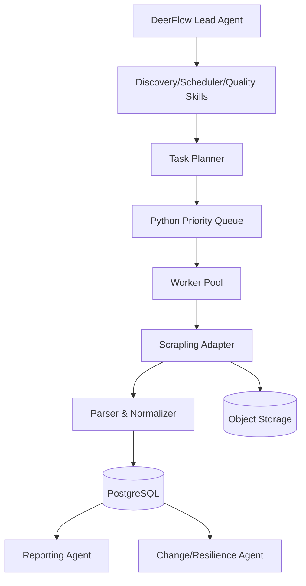

# Design Document

## Overview

本设计实现“DeerFlow 多智能体控制面 + Scrapling 采集数据面”的分层架构，覆盖两类核心采集链路：

1. 专场链路：结标后分段补抓（T+30~90min、次日固定时刻、可选 D+3）。
2. 普通拍卖链路：截标前 5 分钟快照（可选 T-1），并为顺延机制预留最终确认监控。

系统采用“控制面编排 + 数据面确定性执行”策略：
- DeerFlow 负责任务发现、规则修复建议、质量审查和报表分析。
- Python 服务负责调度、执行、解析、入库、重试与恢复。

## Steering Document Alignment

### Technical Standards (tech.md)

当前项目尚未存在 `.spec-workflow/steering/tech.md`，本设计遵循以下技术标准：

1. 队列必须使用 Python 标准库，不引入 Redis/RabbitMQ/Kafka 等中间件。
2. 采集逻辑与编排逻辑解耦，避免 LLM 进入高频热路径。
3. 所有关键写入均实现幂等，支持失败重试和进程重启恢复。

### Project Structure (structure.md)

当前项目尚未存在 `.spec-workflow/steering/structure.md`，本设计建议结构如下：

- `src/config/`：配置项与策略开关
- `src/domain/`：实体与任务模型
- `src/storage/`：数据库与对象存储适配
- `src/queue/`：Python 原生优先队列封装
- `src/scheduler/`：任务生成与到期调度
- `src/workers/`：任务执行器
- `src/scraping/`：Scrapling 采集与解析适配
- `src/agents/`：DeerFlow 技能/工具入口封装
- `src/quality/`：数据质量与异常检测
- `src/reporting/`：统计报表导出

## Code Reuse Analysis

项目当前为初始状态（仅 `main.py` 示例文件），无可复用业务代码，本次按绿地设计落地。

### Existing Components to Leverage

- **Python 标准库**：`queue.PriorityQueue`、`threading`、`asyncio`、`dataclasses`、`sqlite3`（开发期可选）
- **Scrapling 框架能力**：Spider 并发、pause/resume、流式输出
- **DeerFlow 编排能力**：Lead agent 拆解任务、子代理协作、skill + tool 调用

### Integration Points

- **Scrape Tool**：封装 Scrapling，输出统一 `RawPage + ParsedLot` 数据结构。
- **DB Tool**：提供 `auction_session/lot/lot_snapshot/lot_result/task_state` 的读写接口。
- **Storage Tool**：保存 HTML/JSON 快照并返回 `raw_ref`。
- **Queue/Scheduler**：将业务事件转为原生队列任务并执行。

## Architecture

总体采用“分层 + 事件驱动 + 可恢复任务队列”架构。



### Modular Design Principles

- **Single File Responsibility**: 每个模块只处理单一关注点（调度、执行、解析、落库、质量）。
- **Component Isolation**: Agent 决策与抓取执行隔离，避免互相阻塞。
- **Service Layer Separation**: `SchedulerService`（建任务）与 `WorkerService`（执行任务）分离。
- **Utility Modularity**: 时间计算、幂等键、重试退避为独立工具函数。

## Components and Interfaces

### Component 1: TaskScheduler
- **Purpose:** 基于业务规则生成任务并投递到优先队列。
- **Interfaces:**
  - `schedule_discovery(now: datetime) -> list[Task]`
  - `schedule_lot_snapshots(lot: Lot) -> list[Task]`
  - `recover_unfinished_tasks(limit: int) -> list[Task]`
- **Dependencies:** `TaskRepository`, `PolicyConfig`, `PriorityTaskQueue`
- **Reuses:** `time_utils`, `idempotency_utils`

### Component 2: PriorityTaskQueue
- **Purpose:** 封装 Python 原生队列，支持优先级和到期执行。
- **Interfaces:**
  - `put(task: Task) -> None`
  - `get(block: bool = True, timeout: float | None = None) -> Task`
  - `task_done(task_id: str) -> None`
- **Dependencies:** `queue.PriorityQueue`, `threading.Condition`
- **Reuses:** `TaskPriority` 枚举

### Component 3: WorkerPool
- **Purpose:** 拉取任务执行，处理重试、失败落库与告警。
- **Interfaces:**
  - `start(worker_count: int) -> None`
  - `stop(graceful: bool = True) -> None`
  - `execute(task: Task) -> TaskResult`
- **Dependencies:** `PriorityTaskQueue`, `TaskExecutorRegistry`, `TaskRepository`
- **Reuses:** `retry_policy`, `backoff_utils`

### Component 4: ScraplingAdapter
- **Purpose:** 统一采集入口并输出标准原始内容与解析结果。
- **Interfaces:**
  - `fetch_page(url: str, context: FetchContext) -> RawPage`
  - `parse_session(raw: RawPage) -> list[SessionRecord]`
  - `parse_lots(raw: RawPage) -> list[LotRecord]`
- **Dependencies:** Scrapling Spider API
- **Reuses:** `parser_rules`, `normalizers`

### Component 5: SnapshotService
- **Purpose:** 写入快照、落原始证据、维护 `lot_result`。
- **Interfaces:**
  - `save_snapshot(snapshot: LotSnapshot, raw: RawPage) -> SaveResult`
  - `upsert_result(result: LotResult) -> None`
- **Dependencies:** `SnapshotRepository`, `StorageClient`
- **Reuses:** `idempotency_utils`

### Component 6: QualityService
- **Purpose:** 执行质量规则并触发异常任务。
- **Interfaces:**
  - `evaluate_snapshot(snapshot: LotSnapshot) -> QualityScore`
  - `detect_conflicts(lot_id: str) -> list[ConflictIssue]`
  - `detect_parser_drift(site: str, window_min: int) -> DriftAlert | None`
- **Dependencies:** `QualityRuleSet`, `MetricsRepository`
- **Reuses:** `stats_utils`

## Data Models

### Model 1: auction_session
```text
- session_id: string (PK)
- session_type: enum(SPECIAL, NORMAL)
- title: string
- scheduled_end_time: datetime
- source_url: string
- discovered_at: datetime
- updated_at: datetime
```

### Model 2: lot
```text
- lot_id: string (PK)
- session_id: string (FK -> auction_session.session_id)
- title_raw: string
- category: string | null
- grade_agency: string | null
- grade_score: string | null
- end_time: datetime | null
- status: enum(bidding, closed, unknown)
- last_seen_at: datetime
- updated_at: datetime
```

### Model 3: lot_snapshot
```text
- snapshot_id: string (PK)
- lot_id: string (FK -> lot.lot_id)
- snapshot_time: datetime
- snapshot_type: enum(PRE5, PRE1, FINAL, NEXTDAY_FIX)
- current_price: decimal | null
- bid_count: int | null
- raw_ref: string
- quality_score: decimal(5,2)
- idempotency_key: string (UNIQUE)
```

### Model 4: lot_result
```text
- lot_id: string (PK, FK -> lot.lot_id)
- final_price: decimal | null
- final_end_time: datetime | null
- is_withdrawn: bool
- is_unsold: bool
- confidence_score: decimal(5,2)
- decided_from_snapshot: string
- updated_at: datetime
```

### Model 5: task_state
```text
- task_id: string (PK)
- event_type: enum(DISCOVER_SESSIONS, DISCOVER_LOTS, SNAPSHOT_PRE5, SNAPSHOT_PRE1, SNAPSHOT_FINAL_MONITOR, SESSION_FINAL_SCRAPE)
- entity_id: string
- run_at: datetime
- priority: int
- status: enum(pending, running, succeeded, failed, dead)
- retry_count: int
- max_retries: int
- last_error: string | null
- dedupe_key: string (UNIQUE)
- updated_at: datetime
```

## Error Handling

### Error Scenarios

1. **Scenario 1: PRE5 高峰期任务拥塞导致延迟执行**
   - **Handling:** 启用优先级抢占、动态提升 `PRE5` worker 配额、超时任务立即补执行并标注延迟秒数。
   - **User Impact:** 快照可能延迟但不会静默丢失，报表可见延迟标记。

2. **Scenario 2: 页面结构变更导致解析失败率升高**
   - **Handling:** 达阈值后触发 `PARSER_DRIFT` 告警，自动降级为只保存原始页面并推送规则修复任务。
   - **User Impact:** 结构化字段暂时下降，但原始证据保留，便于快速修复回放。

3. **Scenario 3: 任务执行中进程重启**
   - **Handling:** 启动时扫描 `task_state` 中 `pending/running` 且到期任务，重新入队并做去重保护。
   - **User Impact:** 任务可恢复执行，不会因进程重启永久丢失。

4. **Scenario 4: 顺延监控期间长时间无稳定终态**
   - **Handling:** 达到最大监控窗口（如 90 分钟）后退出并写“未确认终态”标记，次日补抓兜底。
   - **User Impact:** 当日可能缺最终价，但后续补抓可修复。

## 测试流程

### 流程阶段
1. 本地自测：开发者在提交前运行单元测试与静态检查。
2. 集成验证：在测试库执行任务链路测试（调度、入队、执行、入库、回写状态）。
3. 端到端验证：执行模拟站点场景，验证主流程和顺延异常流程。
4. 回放验证：解析规则变更后，对历史 `raw_ref` 样本重跑并比对差异。
5. 发布门禁：仅当所有阶段通过，才允许进入发布。

### 自动化门禁
- CI 必须串行执行 `unit -> integration -> e2e -> replay` 四类任务。
- 任一阶段失败立即终止流水线并输出失败报告（失败任务、影响模块、责任人）。
- 对核心指标设置阈值告警（PRE5 延迟、解析失败率、回放偏差率）。

### 出口标准
- 单元测试通过率 100%，核心模块覆盖率不低于 80%。
- 集成测试覆盖专场补抓与普通拍卖 PRE5 两条主链路。
- 端到端测试覆盖至少 1 个顺延案例和 1 个次日修正案例。
- 回放测试的关键字段偏差率小于配置阈值（默认 1%）。

## Testing Strategy

### Unit Testing
- 测试 `TaskScheduler` 的时间计算与任务生成规则（PRE5、次日补抓、D+3）。
- 测试 `PriorityTaskQueue` 的优先级行为、阻塞获取和并发安全。
- 测试 `idempotency_utils`、`retry_policy`、`normalizers`。

### Integration Testing
- 以本地测试库验证 `task_state -> queue -> worker -> snapshot/result` 全链路。
- 验证普通拍卖顺延场景：初始 end_time 到期后延长，监控任务持续到 closed。
- 验证专场三段式补抓的任务创建和幂等更新。

### End-to-End Testing
- 场景 1：发现专场 -> 发现 lot -> 次日补抓 -> 生成结果与报表。
- 场景 2：普通拍卖 PRE5 触发 -> 快照落库 -> 最终确认（可选）-> 质量评分。
- 场景 3：人为注入解析失败 -> 触发 drift 告警 -> 修复后回放重算。
