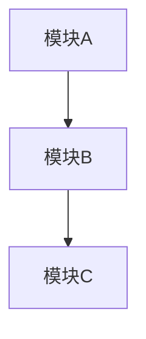

# Design Document

## Overview

[描述设计目标、系统边界、关键权衡]

## Steering Document Alignment

### Technical Standards (tech.md)
[说明如何遵循技术规范]

### Project Structure (structure.md)
[说明如何遵循目录与分层约定]

## Code Reuse Analysis

[说明复用、扩展、替换点]

### Existing Components to Leverage
- **[组件/工具]**: [复用方式]

### Integration Points
- **[系统/接口]**: [集成方式]

## Architecture

[总体架构、关键时序、模块边界]



### Modular Design Principles
- **Single File Responsibility**: 单文件单职责
- **Component Isolation**: 模块隔离，避免隐式耦合
- **Service Layer Separation**: 访问层/业务层/编排层分离
- **Utility Modularity**: 工具函数可复用、可测试

## Components and Interfaces

### Component 1
- **Purpose:** [用途]
- **Interfaces:** [公开方法/API]
- **Dependencies:** [依赖]
- **Reuses:** [复用点]

### Component 2
- **Purpose:** [用途]
- **Interfaces:** [公开方法/API]
- **Dependencies:** [依赖]
- **Reuses:** [复用点]

## Data Models

### Model 1
```text
- [字段]: [类型/约束]
```

### Model 2
```text
- [字段]: [类型/约束]
```

## Error Handling

### Error Scenarios
1. **Scenario 1:** [场景]
   - **Handling:** [处理策略]
   - **User Impact:** [用户影响]

2. **Scenario 2:** [场景]
   - **Handling:** [处理策略]
   - **User Impact:** [用户影响]

## 测试流程

### 流程阶段
1. 本地自测：单元测试 + 静态检查
2. 集成验证：关键链路联调测试
3. 端到端验证：核心业务路径 + 异常路径
4. 回放验证：规则变更后的历史样本重跑（如适用）
5. 发布门禁：任一阶段失败即阻断发布

### 自动化门禁
- 定义统一测试入口（脚本或 CI 流水线）
- 定义失败即中断与报告输出机制
- 定义关键质量指标阈值（通过率、覆盖率、延迟、错误率）

### 出口标准
- [明确通过标准与验收阈值]

## Testing Strategy

### Unit Testing
- [单元测试策略]

### Integration Testing
- [集成测试策略]

### End-to-End Testing
- [端到端测试策略]
