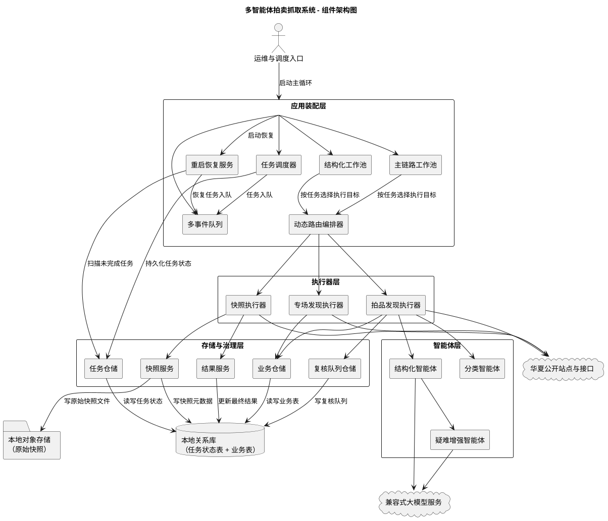
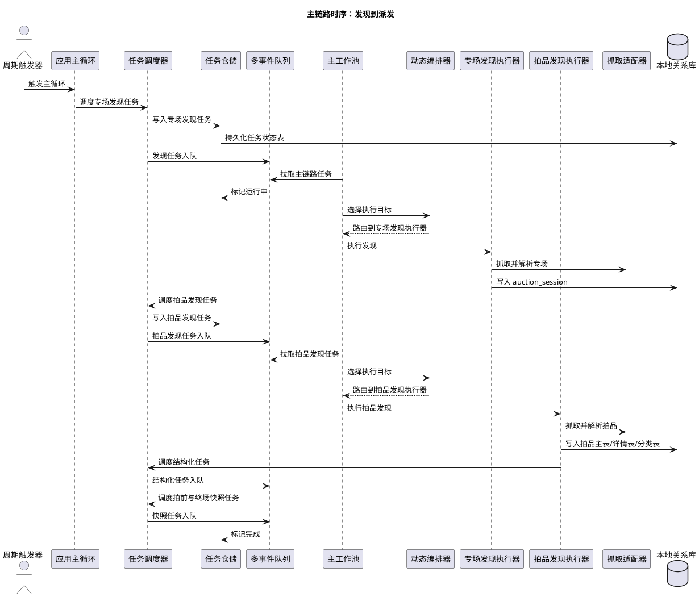
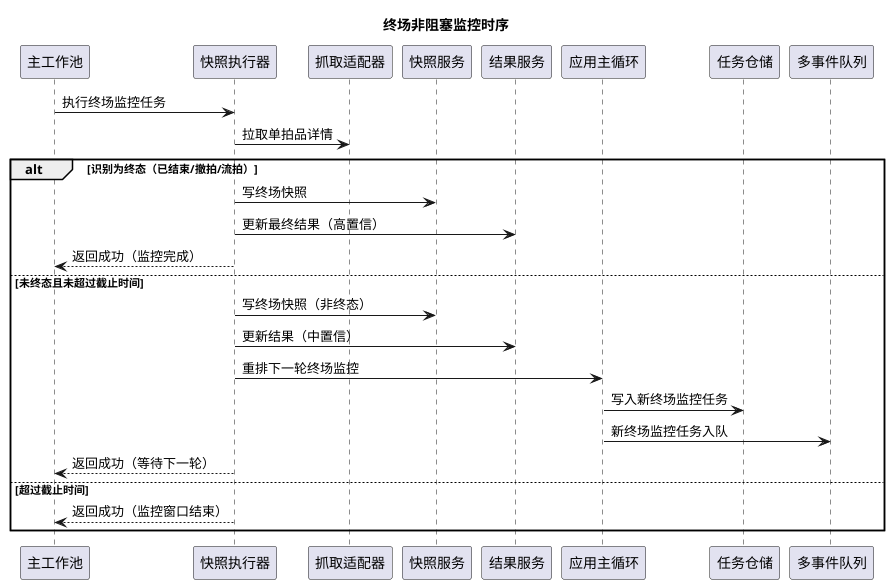
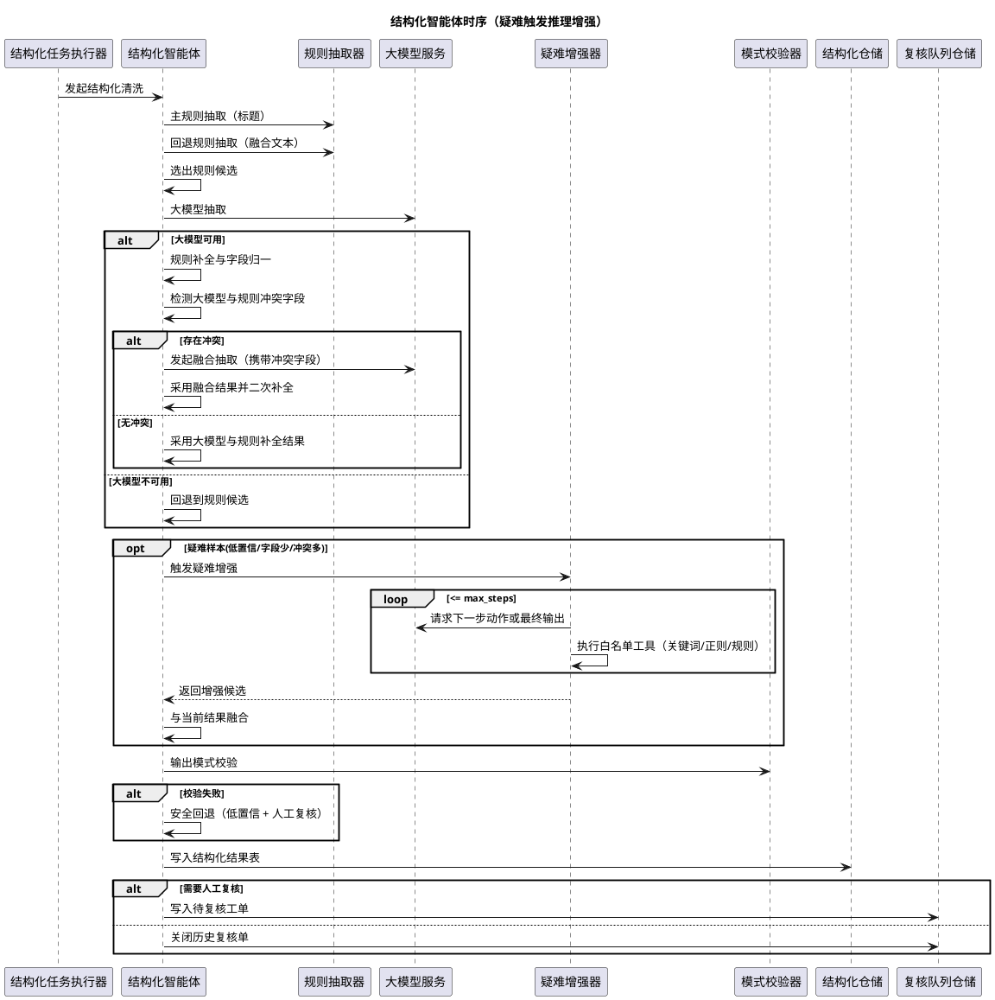

# 多智能体拍卖抓取系统 系统分析与设计说明（系分）

## 1. 文档目标

本文给出当前系统的可落地系分说明，覆盖：

- 业务目标与范围
- 架构设计与模块边界
- 核心数据模型
- 关键流程时序（PlantUML）
- 智能体与疑难增强设计与治理
- 可靠性、性能与演进建议

适用对象：研发、架构评审、运维。

---

## 2. 业务目标与范围

### 2.1 目标

系统目标是稳定完成以下闭环：

1. 周期发现专场（session）
2. 发现专场下拍品（lot）
3. 抓取拍品详情与时点快照（拍前5分钟/拍前1分钟/终场/次日修正）
4. 智能结构化抽取（规则 + 大模型 + 疑难增强）
5. 结果入库与复核队列治理

系统处理对象包含两类会话：

- 专场（SPECIAL）
- 普通拍卖/非专场（NORMAL）

两类会话都进入“发现拍品 -> 详情抓取 -> 快照 -> 结构化”主链路；仅专场额外进入“分段补抓（结标后/次日/可选D+3）”。

### 2.2 非目标

- 不提供在线人工审核前端（仅提供 `review_queue` 数据面）
- 不实现外部消息队列中间件（当前为进程内队列 + SQLite 持久化）

---

## 3. 总体架构

### 3.1 架构风格

系统采用“事件驱动 + 任务状态机 + 双 Worker 池”架构：

- 调度层负责“何时做什么”
- 执行层负责“如何做”
- 存储层统一仓储接口，持久化任务与业务数据
- 智能体层独立成结构化链路，采用可治理输出机制

### 3.2 组件图（PlantUML）

---

## 4. 分层与模块职责

### 4.1 启动与装配层

- `src/app.py`
- 责任：
  - 依赖注入（Scheduler/Queue/Executors/Repos/Agents）
  - 启停生命周期管理
  - 主循环派发 `DISCOVER_SESSIONS`
  - 双 Worker 池拆分（主链路 vs 结构化）

### 4.2 调度层

- `src/scheduler/policies.py`
- `src/scheduler/task_scheduler.py`
- 责任：
  - 规则化生成事件（PRE5/PRE1/FINAL/POST_CLOSE/NEXTDAY）
  - 事件转任务并落 `task_state`
  - 幂等入队

### 4.3 队列与执行层

- `src/queue/multi_task_queue.py`
- `src/workers/pool.py`
- `src/workers/executors/*.py`
- 责任：
  - 多事件子队列、按优先扫描
  - Worker 消费、状态迁移、失败重试
  - 线程自愈（monitor 自动拉起）

### 4.4 抓取与解析层

- `src/scraping/adapter.py`
- `src/scraping/parsers/hx_parser.py`
- 责任：
  - 对站点/API抓取封装
  - 全局节流（`min_fetch_interval_seconds`）
  - 统一 `ParsedSession/ParsedLot/ParsedLotDetail` 输出

### 4.5 智能体层

- 分类 Agent：`LotClassifierAgent`
- 结构化 Agent：`TitleDescriptionStructuredAgent`
- ReAct 增强：`ReactStructuredExtractor`
- 责任：
  - 类目识别
  - 标题/描述结构化抽取与融合
  - 疑难样本多步工具推理
  - 低置信度复核入队

### 4.6 存储层

- `src/storage/repositories/*`
- `src/services/snapshot_service.py`
- `src/services/result_service.py`
- 责任：
  - 业务对象 upsert
  - 快照幂等（分钟桶 `idempotency_key`）
  - 结果防回退更新（置信度优先 + 终态保护）

---

## 5. 核心数据模型

### 5.1 关键表

- `task_state`：任务状态机（`pending/running/succeeded/failed/dead`）
- `auction_session`：专场
- `lot`：拍品基础信息
- `lot_detail`：拍品详情
- `lot_snapshot`：时点快照（含质量分、raw_ref）
- `lot_result`：最终成交/流拍/撤拍结果
- `lot_classification`：分类结果
- `lot_structured`：结构化字段
- `review_queue`：人工复核队列

### 5.2 幂等键设计

任务幂等键按业务语义而非时间戳：

- 发现/结构化：`event_type:entity_id`
- 专场补抓：`event_type:entity_id:stage`
- 快照：`event_type:entity_id:snapshot_type`

收益：

- 避免重复派发引发队列膨胀
- 保持任务语义级唯一性
- 便于重启恢复与重排

---

## 6. 关键设计决策

### 6.1 双 Worker 池解耦

- 主池：`DISCOVER_* + SNAPSHOT_* + SESSION_FINAL_SCRAPE`
- 专池：`STRUCTURE_LOT`

目的：结构化耗时不阻塞抓取主链路。

### 6.2 终场监控非阻塞化

- 每轮只执行一次探测
- 未终态则延后重排下一轮
- 到截止时间后停止监控

目的：防止单个终场监控任务长时间占用工作线程。

### 6.3 专场与非专场差异化调度

- 专场（SPECIAL）：
  - 调度 `DISCOVER_LOTS`
  - 调度拍品快照任务（拍前/终场）
  - 额外调度专场补抓任务（结标后/次日/可选D+3）
- 非专场（NORMAL）：
  - 调度 `DISCOVER_LOTS`
  - 调度拍品快照任务（拍前/终场）
  - 不调度专场级分段补抓任务

说明：非专场拍品不会缺席主链路，只是不走“专场补抓”这条专用支路。

### 6.4 结果防回退

`lot_result` 更新策略：

- 低置信度空值不能覆盖已有成交价
- 高置信终态（流拍/撤拍）允许清空价格
- `final_end_time` 只增不减
- `confidence_score` 取更高值

### 6.5 恢复与自愈

- 重启恢复：回收 unfinished 任务
- Worker 线程监控：死线程自动拉起
- 失败任务：指数退避重试，超过上限进 `dead`

---

## 7. 核心时序图

### 7.1 主链路：发现专场 -> 发现拍品 -> 派发后续任务

### 7.2 终场非阻塞监控时序

### 7.3 结构化智能体时序（规则 + 大模型 + 疑难增强 + 模式校验治理）

---

## 8. 智能体设计说明

### 8.1 多智能体分工

1. 路由智能体（DynamicSkillOrchestrator）
   - 输入：任务上下文
   - 输出：执行目标（Discovery/Lot/Snapshot）
   - 失败回退：静态映射
2. 分类智能体（LotClassifierAgent）
   - 类别与标签识别
3. 结构化智能体（TitleDescriptionStructuredAgent）
   - 字段化抽取、冲突融合、复核判定
4. ReAct 智能体（ReactStructuredExtractor）
   - 疑难样本多步取证

### 8.2 疑难增强工具集合（受限）

- `find_keyword`
- `regex_extract`
- `rule_extract`

说明：工具白名单限制在“读文本与规则提示”，避免任意执行风险。

### 8.3 疑难触发条件

满足任一条件触发 ReAct：

- 置信度低于阈值
- 核心字段数量不足
- `grade_score` 存在但无评级公司
- 大模型/规则冲突字段过多

---

## 9. 输出治理（防幻觉、防脏数据）

### 9.1 治理链路

1. 规则抽取建立高精度基线
2. 大模型抽取后进行字段标准化与清洗
3. 规则与大模型冲突时走融合
4. 疑难样本触发疑难增强工具取证
5. 最终输出必须通过 JSON Schema
6. 校验失败走 `schema_fallback`（低置信 + 强制人工复核）

### 9.2 关键收益

- 防止大模型非法结构直接入库
- 防止空值/脏值污染核心字段
- 把“机器不确定性”显式沉淀到 `review_queue`

---

## 10. 稳定性与性能设计

### 10.1 稳定性

- 任务状态持久化，进程崩溃可恢复
- 重试策略：指数退避 + `dead` 终止
- Worker 自愈：线程异常自动拉起
- 快照占位策略：缺失数据不抛错风暴

### 10.2 性能

- 抓取节流：全局最小请求间隔（默认 3s）
- 多队列扫描：优先主链路事件
- 结构化异步化：从主链路解耦
- 终场监控非阻塞重排：降低长任务占用

---

## 11. 当前风险与改进建议

### 11.1 风险

- 进程级守护依赖启动方式（建议引入系统级守护如 launchd/supervisor）
- SQLite 在更高并发场景下有写竞争上限
- 复核队列目前仅数据化，缺少闭环操作台

### 11.2 建议

1. 增加健康探针与告警（成功速率、运行中任务数为0、死信任务激增）
2. 引入可视化运维面板（任务吞吐、堆积、失败画像）
3. 若并发继续提升，评估迁移到外部队列与分布式存储
